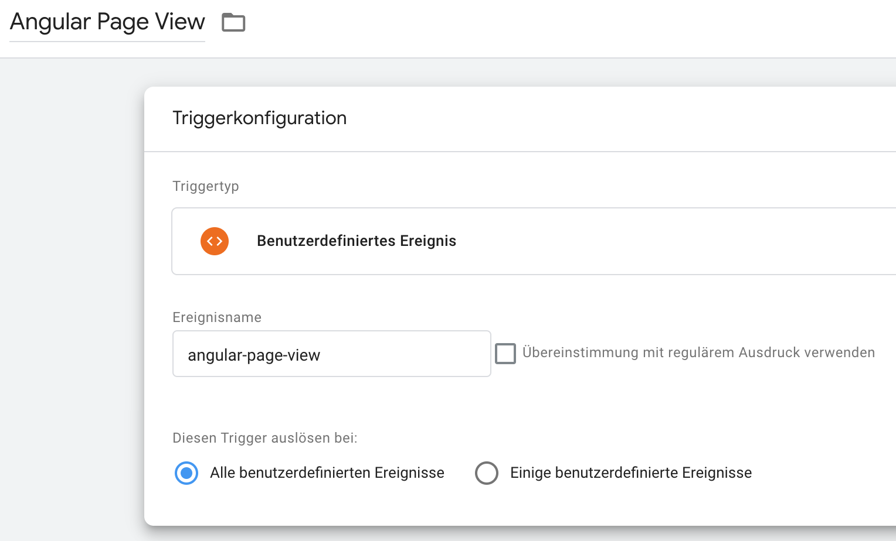
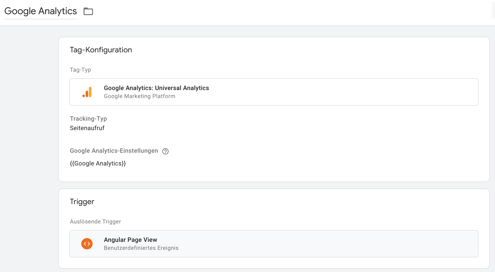

# ngx-gtm-cookie-consent

[](https://www.npmjs.com/package/ngx-gtm-cookie-consent)

An Angular library to comply with the GDPR and the latest european law regarding cookies 🍪

> This project is work-in-progress. Features and Documentation are probably not complete.

## Usage

1. Install dependencies

`npm install --save ngx-gtm-cookie-consent ngx-cookieconsent cookieconsent`

or

`yarn add ngx-gtm-cookie-consent ngx-cookieconsent cookieconsent`

2. Add the following to your `angular.json`:

```json
{
    "assets": [
        {
            "glob": "**/cookie-consent.js",
            "input": "node_modules/ngx-gtm-cookie-consent/static-js",
            "output": "./ngx-gtm-cookie-consent"
        }
    ],
    "styles": [
        "node_modules/cookieconsent/build/cookieconsent.min.css"
    ],
    "scripts": [
        "node_modules/cookieconsent/build/cookieconsent.min.js"
    ]
}
```

3. Add a script in your `index.html` head section:

```html
<script src="ngx-gtm-cookie-consent/cookie-consent.js"></script>
```

4. Create a `cookieConfig` object (see [ngx-cookieconsent](https://github.com/tinesoft/ngx-cookieconsent/blob/master/src/service/cookieconsent-config.ts))

5. Add imports to your `AppModule`:

```ts
@NgModule({
  declarations: [
    AppComponent
  ],
  imports: [
    NgcCookieConsentModule.forRoot(cookieConfig),
    CookieModule.forRoot({
      gtmContainerId: 'GTM-XXXYYY', // Your Google Tag Manager container ID
      enable: true, // Control this from your environment files
      cookieConsentPopUpConfig: cookieConfig
    })
  ]
})
export class AppModule { }
```

6. Create a new trigger in Google Tag Manager



7. Use the new trigger to fire tags (e.g. for Google Analytics)


